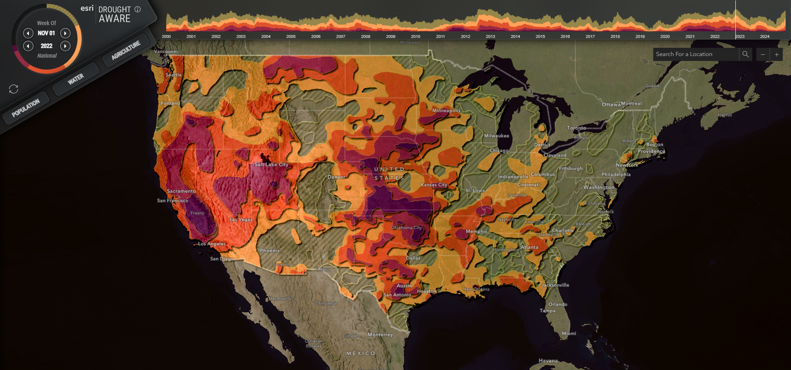

# Drought Aware Application

## Run this App

- node version 18.18.0
- ```npm install``` to install dependencies
- ```npm run start``` to run the application

## About this App

The Drought Aware app provides information about drought-affected areas in the U.S. over various time intervals (from 2000 to the present) and across different drought intensities. It provides summaries of the affected population and the potential impacts on crops, agricultural labor, rivers, and reservoirs.

## Use this App

Display drought maps for different weeks by clicking on the time-series chart (top bar) or by scrolling through time using the sector chart (top-left). Hover on each drought intensity level in the sector chart to highlight the areas on the map and display the area percentage. Click on the map to display a panel with summary information for the selected area. The panel includes three categories: population, water, and agriculture.



## App Categories

The Drought Aware app summarizes three information categories that drought may impact.

- **Population**: Displays the estimated number of people and households affected by drought at each intensity level. It also describes some vulnerable populations and lists the related drought risk indexes. The data is available at the county and state levels.
- **Water**: Depicts major local rivers, including the average inter-annual river flow and the relevant local reservoirs. The data is available at the Subregion Hydrologic Units (HUC4).
- **Agriculture**: Displays the potential economic impact of drought on major crops, affected labor, and the agricultural exposure to droughts. The data is available at the county and state levels.

## Drought Definitions

- **Abnormally Dry (D0)**
- - Going into drought there is short-term dryness slowing planting, growth of crops or pastures.
- - Coming out of drought there are some lingering water deficits; pastures or crops not fully recovered.
- **Moderate Drought (D1)**
- - Some damage to crops and pastures.
- - Streams, reservoirs, or wells low, some water shortages developing or imminent.
- - Voluntary water-use restrictions requested.
- **Severe Drought (D2)**
- - Crop or pasture losses likely.
- - Water shortages are common.
- - Water restrictions imposed.
- **Extreme Drought (D3)**
- - Major crop/pasture losses.
- - Widespread water shortages or restrictions.
- **Exceptional Drought (D4)**
- - Exceptional and widespread crop/pasture losses.
- - Shortages of water in reservoirs, streams, and wells create water emergencies.

## Data Sources

The data layers used in this app can be found in [ArcGIS Living Atlas of the World](https://livingatlas.arcgis.com/):

- [U.S. Drought Monitor](https://www.arcgis.com/home/item.html?id=9731f9062afd45f2be7b3bf2e050fbfa)
- [American Community Service (ACS)](https://livingatlas.arcgis.com/en/browse/?q=ACS#q=ACS&d=2)
- [USDA Census of Agriculture](https://livingatlas.arcgis.com/en/browse/?q=%22USDA%20Census%20of%20Agriculture%22#q=%22USDA+Census+of+Agriculture%22&d=2)
- [FEMA National Risk Index](https://livingatlas.arcgis.com/en/browse/?q=owner:%22FEMA_NationalRiskIndex%22#q=owner%3A%22FEMA_NationalRiskIndex%22&d=2)
- [National Water Model (NWM)](https://livingatlas.arcgis.com/en/browse/?q=%22National%20Water%20Model%22#q=%22National+Water+Model%22&d=2)
- [National Hydrography Dataset (NHD)](https://livingatlas.arcgis.com/en/browse/?q=%22National%20Hydrography%20Dataset%22#q=%22National+Hydrography+Dataset%22&d=2)
- [National Inventory of Dams (NID)](https://www.arcgis.com/home/item.html?id=a4c195b7a6b74f278ff43e5d60c6915d)
- [National Boundary Dataset (WBD)](https://livingatlas.arcgis.com/en/browse/?q=%22Watershed%20Boundary%20Dataset%22#q=%22Watershed+Boundary+Dataset%22&d=2)

## Drought Update Frequency

The Drought Aware app includes weekly updates to the drought data, in line with the latest [U.S. Drought Monitor](https://www.arcgis.com/home/item.html?id=9731f9062afd45f2be7b3bf2e050fbfa) map. The update process is automated using the Esri [Aggregated Live Feed Methodology](https://www.arcgis.com/home/group.html?content=all&id=c42fd84aa35a4ab39806f6481b80c0a0#overview).

The update frequency for other app data layers varies depending on the type of layer and is detailed in the source descriptions above.

## License

This app is provided for informational purposes and is not monitored 24/7 for accuracy and currency and is licensed under the Esri Master License Agreement.
- [View Summary](https://downloads2.esri.com/arcgisonline/docs/tou_summary.pdf)
- [View Terms of Use](https://www.esri.com/en-us/legal/terms/full-master-agreement)

This codebase is licensed under the Apache License, Version 2.0 (the "License");
you may not use this file except in compliance with the License.
You may obtain a copy of the License at

   http://www.apache.org/licenses/LICENSE-2.0

Unless required by applicable law or agreed to in writing, software
distributed under the License is distributed on an "AS IS" BASIS,
WITHOUT WARRANTIES OR CONDITIONS OF ANY KIND, either express or implied.
See the License for the specific language governing permissions and
limitations under the License.

A copy of the license is available in the repository's [license.txt]( https://raw.github.com/Esri/drought-tracker/master/LICENSE.txt) file.

## Contributing

Esri welcomes contributions from anyone and everyone. Please see our [guidelines for contributing](https://github.com/esri/contributing).

## Contact

For questions or comments about the Drought Aware app, please contact us at [environment@esri.com](mailto:environment@esri.com)

The latest version of the Drought Aware project was released in 2024. The project's design and cartography was done by John Nelson, the data is supported by Gonzalo Espinoza-Davalos, the application was developed by Nathan Traylor, and the project was overseen by Ken Baloun.